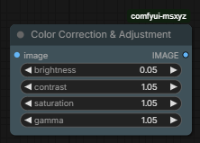

# comfyui-msxyz
AdvancedColorAdjustment

# ComfyUI Color Adjustment Node

This node allows you to quickly adjust the brightness, contrast, saturation, and gamma of your images within ComfyUI. It runs efficiently on the GPU using native PyTorch operations.

## Features
- **Brightness:** Adjust the overall lightness of the image.
- **Contrast:** Enhance or reduce the tonal range.
- **Saturation:** Control the intensity of colors.
- **Gamma:** Fine-tune mid-tones for better color balance.

## How to use
Simply connect your image input, adjust the sliders, and get your processed result instantly.
