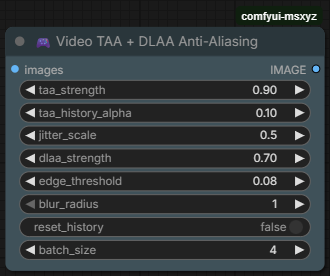

# ComfyUI Video Anti-Aliasing Pack (TAA + DLAA)

These ComfyUI nodes provide advanced anti-aliasing solutions for videos and images.  
The VideoTAADLAA node combines Temporal Anti-Aliasing (TAA) and Deep Learning Anti-Aliasing (DLAA) techniques to deliver sharp and smooth results, while the VideoAdaptiveAA node smooths only jagged (aliasing-prone) areas.

---

## Preview

<p align="center">
  
  
</p>

---

## Features

- **Temporal Anti-Aliasing (TAA):** Stabilizes flickering in video sequences using frame history.
- **DLAA (Deep Learning AA):** Neural-based cleanup of residual aliasing without losing texture detail.
- **Ghosting-Free Logic:** Advanced history clamping prevents trailing artifacts in fast motion.
- **Halton Sequence Jittering:** Improves sub-pixel sampling for cleaner edges.
- **Edge-Aware Weighting:** Preserves fine details while blending.
- **Adaptive Anti-Aliasing (AdaptiveAA):** Targets only aliasing-prone regions for localized smoothing.

---

## Compare

<p align="center">
  
  
  
</p>

---

## Installation

Recommended: Install via ComfyUI-Manager.

Manual installation:

```bash
cd ComfyUI/custom_nodes/
git clone https://github.com/MSXYZ-GenAI/comfyui-msxyz.git