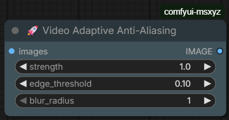

# comfyui-msxyz
🚀 Video Adaptive Anti-Aliasing

# Anti-Aliasing Node
A professional-grade, edge-aware anti-aliasing post-processing node for ComfyUI. This node is specifically designed to eliminate jagged edges (aliasing) in AI-generated videos and images without sacrificing overall texture detail.

📝 Description
AI video generation often suffers from "pixel crawling" or "staircase effects" (aliasing) on high-contrast edges. Traditional blur filters fix this by blurring the entire frame, which results in a loss of sharpness.

✨ Features
Smart Edge Detection: Uses mathematical gradients to find jagged boundaries.
Detail Preservation: Keeps faces, textures, and backgrounds sharp while smoothing only the "noisy" edges.
Adaptive Blending: Smoothly transitions between the original image and the anti-aliased edges.
Native Batch Support: Optimized for video workflows and large image batches.

🛠 Installation
Navigate to your ComfyUI directory: ComfyUI/custom_nodes/.
Create a new folder named MyCustomAA.
Place the video_aa_node.py and __init__.py files into that folder.
Restart ComfyUI.

🚀 Parameters & Usage
Find the node under: CustomPostProcess -> 
Parameter	Type	Description	Recommended Value
strength	FLOAT	The intensity of the smoothing effect.	0.8 - 1.2
edge_threshold	FLOAT	Sensitivity of edge detection. Lower = more areas smoothed.	0.10 - 0.20
blur_radius	INT	The width of the anti-aliasing filter.	1 (Sharper) or 2 (Softer)
Ideal Workflow Placement:
VAE Decode -> Video Adaptive AA -> Video Combine (VHS)

💡 Pro Tips
For Upscaling: Always place this node after an upscale operation to clean up any pixel interpolation artifacts.
For Animation: If you notice "flickering" on thin lines, decrease the edge_threshold to allow the node to cover more subtle edges.
