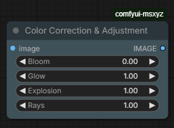

# comfyui-msxyz
LightExplosion

# ComfyUI Light Adjustment Node

This node allows you to quickly adjust lighting in images within ComfyUI. It runs efficiently on the GPU using native PyTorch operations.

## Features
- **Bloom:** Adjust the overall bloom effect of the image.
- **Glow:** Enhance or reduce the overall tonal range.
- **Explosion:** Controls gamma intensity (light “burst” effect).
- **Rays:** Fine-tune mid-tones for better light balance.

## How to use
Simply connect your image input, adjust the sliders, and get the processed result instantly.

## Installation
Install the ComfyUI node from GitHub:

1. Download the ZIP file from GitHub
2. Extract it into:
